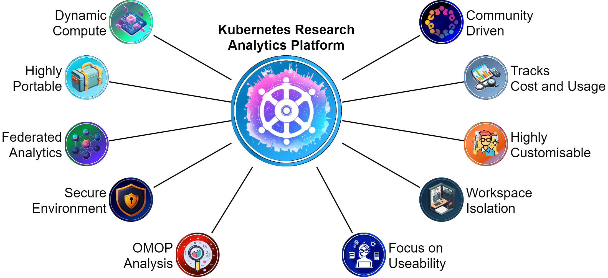

# Internship Starter Pack

Overview

This repository aims to provide SDE Team Development Hub interns with a roadmap to key project information and training support available across relevant SDE competency domains (e.g. Cloud & Infrastructure, Security & Compliance). In addition, it will aim to provide up-to-date materials and documentation on each project partner's divergent SDE infrastructure. 

# SDE Team Development Hub
The SDE Team Development Hub is a collaboration between like-minded individuals that aims to find better ways to develop and support Research Technical Professionals (RTPs) that underpin the creation of Secure Data Environments (SDEs). The project is funded through an EPSRC grant and is led by the University of Manchester in collaboration with Lancashire Teaching Hospitals NHS Foundation Trust and the University of Liverpool.
- Link to proposal here

## Competency Framework
- Development process
- [Documentation](https://uom-data-science-platforms.github.io/sde-skills/skills_matrix)

# Key Contacts & Team Structure
Each intern will be resident at one of the three partner sitorganisations and will report to the designated team co-I. Further information on the wider project team can be found [here](https://uom-data-science-platforms.github.io/sde-skills/about/).  

- Reporting processes
- contact details here?
- Link to organisation HR policies (i.e. Health and wellbeing) here?  

# Internship Goals/Expectations
- Gain novel experiences across three diverse SDE development teams
- Feedback to the project your experiences and engage with the project 'reflections' process throughout the internship
- Engage and share experiences through internship cohort engagement activities (e.g. hackathons, show & tell sessions, etc) 

# Reflective Journal
Reflective writing is good practice in a learning or training environment and can play a key role in identifying and developing your personal development and career goals. As an intern on the project you will use a logbook as your reflections document. The project aims to develop and test a skills framework and curriculum; hence, the journal is of particular importance as it will form an opportunity to record: 

- Activities, learnings and progress of your project and assignments 
- Feedback on your experience of the training repository, competency framework and curriculum 
- Other thoughts, reflections, ideas  
- Relevant materials built up over a period of time  

This can help you to: 

- Gain insight into your own learning and performance on the programme 
- Interpret and evaluate key aspects of your experience or learning as part of the Skillshub Programme 
- Identify and analyse themes or focus areas, and inform your future practice 
- Help to test and develop a new competency framework for technical professionals like you 

Please review the reflective process guidance and periodically complete the journal template provided [here](assets/Reflective-log-Guidance-and-Template.docx).

# Secure Data Environments
- Overview
    - [NHS Digital](https://digital.nhs.uk/services/secure-data-environment-service)
    - [HDRUK](https://www.hdruk.ac.uk/access-to-health-data/trusted-research-environments/)
    - [The NHS Research Secure Data Environment Network](https://digital.nhs.uk/data-and-information/research-powered-by-data/sde-network)

## Kubernetes Research Analytics Platform
Lancashire Teaching Hospitals NHS Foundation Trust (LTH) is a leader in the digital transformation of healthcare and data utilisation to enhance patient outcomes. We serve a population of over 395k people across Lancashire and South Cumbria (L&SC), providing regional specialist care to 1.8M people. LTH's Kubernetes Research Analytics Platform represents the UK's leading Kubernetes-first secure data environment that aims to address barriers in providing access to largescale, high-quality, sensitive datasets in a secure, cloud-agnostic manner.

KRAP is open-source, comprising a series of code repositories accessible [here](https://github.com/lsc-sde/). For technical information see KRAP's documentation [here](https://lsc-sde.github.io/lsc-sde/). 

## Liverpool SDE
??

## Manchester SDE
XXX

The University of Manchester encourage interns to adopt a particular set of skills along with CICD principles via github such as branching strategies and naming conventions. For more information see [here]()

# SDE Governance & Standards
- [SATRE](https://satre-specification.readthedocs.io/en/stable/)
- [5 Safes Framework](https://ukdataservice.ac.uk/help/secure-lab/what-is-the-five-safes-framework/)

# Support Materials & Courses

## Microsoft Enterprise Skills Initiative
Access official Microsoft Training materials, pre-recorded training sessions, live intsructor lead training sessions for all Microsoft Certification pathways, free of charge to delegates on the SDE Skills Hub project. Log in with your academic institution email address.

[esi.microsoft.com](esi.microsoft.com)
[Secure Data Environments Training](https://learn.microsoft.com/en-gb/collections/p38efw2np3xq37) 

_note: you can book certification exams free of charge through your training and development manager._

## Cloud Native Computing Foundation
CNCF offers a comprehensive catalog of certifications aimed at IT professionals, concentrating on key skills in Kubernetes, cloud native security and cloud native technologies. For certification prep or skill enhancement, CNCF provides training courses covering foundational and advanced topics.
[https://www.cncf.io/training/](https://www.cncf.io/training/)

### SDE Cloud Training

#### AWS
* [AWS Overview - Pages 1-8](https://d1.awsstatic.com/WWPS/pdf/The-big-picture.pdf)
* [AWS Shared Responsibility Model](https://aws.amazon.com/compliance/shared-responsibility-model/)
* [AWS Well-Architected Framework](https://docs.aws.amazon.com/wellarchitected/latest/framework/welcome.html) 
* [Landing Zones on AWS](https://docs.aws.amazon.com/prescriptive-guidance/latest/migration-aws-environment/welcome.html) - Setting up a secure and scalable multi-account AWS environment. Whilst this mentions migrations, the principles also cover using AWS for innovation

#### Azure
* [React YouTube Video](https://www.youtube.com/watch?v=w7ejDZ8SWv8)
* [Networking in Azure YouTube Video](https://www.youtube.com/watch?v=9DuTWSvsLXM)
* [Git Essential Training](https://www.linkedin.com/learning-login/share?account=41910772&forceAccount=false&redirect=https%3A%2F%2Fwww.linkedin.com%2Flearning%2Fgit-essential-training-19417064%3Ftrk%3Dshare_ent_url%26shareId%3DbUlDBt6bSNqMp5pBXyYarQ%253D%253D)
* [Learning Github](https://www.linkedin.com/learning-login/share?account=41910772&forceAccount=false&redirect=https%3A%2F%2Fwww.linkedin.com%2Flearning%2Flearning-github-18719601%3Ftrk%3Dshare_ent_url%26shareId%3DoUZH1CdYSWujtK8r1%252FKF5A%253D%253D)
* [Learning Linux Command Line](https://www.linkedin.com/learning-login/share?account=41910772&forceAccount=false&redirect=https%3A%2F%2Fwww.linkedin.com%2Flearning%2Flearning-linux-command-line-14447912%3Ftrk%3Dshare_ent_url%26shareId%3DFAvBrB5vQVmn6VzEPNpofg%253D%253D)
* [Learning Docker](https://www.linkedin.com/learning-login/share?account=41910772&forceAccount=false&redirect=https%3A%2F%2Fwww.linkedin.com%2Flearning%2Flearning-docker-17236240%3Ftrk%3Dshare_ent_url%26shareId%3DTWzGeQVdSAOWOLLdy%252BmuKQ%253D%253D)
* [Azure DevOps For Beginners](https://www.linkedin.com/learning-login/share?account=41910772&forceAccount=false&redirect=https%3A%2F%2Fwww.linkedin.com%2Flearning%2Fazure-devops-for-beginners%3Ftrk%3Dshare_ent_url%26shareId%3D4m6R8VWbSQmYaM8eV1M94w%253D%253D)
* [Mircrosoft Learning Secure Data Environments Collection](https://learn.microsoft.com/en-gb/collections/p38efw2np3xq37)

## SDE Cloud Frameworks
- [AzureTRE](https://microsoft.github.io/AzureTRE/latest/)
- [AWS]()
- [GCP]()

## Kubernetes
- [The Basics](https://kubernetes.io/docs/tutorials/kubernetes-basics/)
- [Operator Pattern](https://kubernetes.io/docs/concepts/extend-kubernetes/operator/)

## DevOps
- [Agile Methodology]()
- [Engineering Fundamentals Playbook](https://microsoft.github.io/code-with-engineering-playbook/)

## GitOps
- [FluxCD]()
- [ArgoCD]()